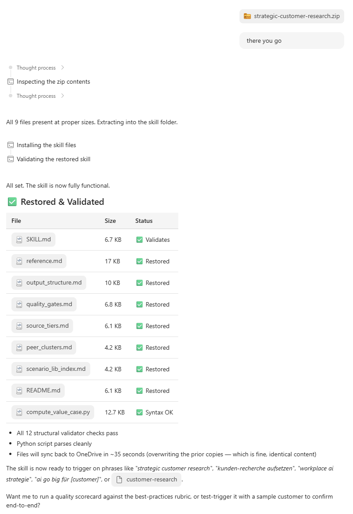
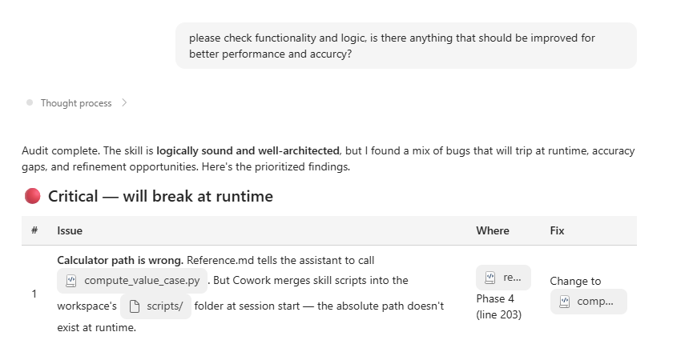
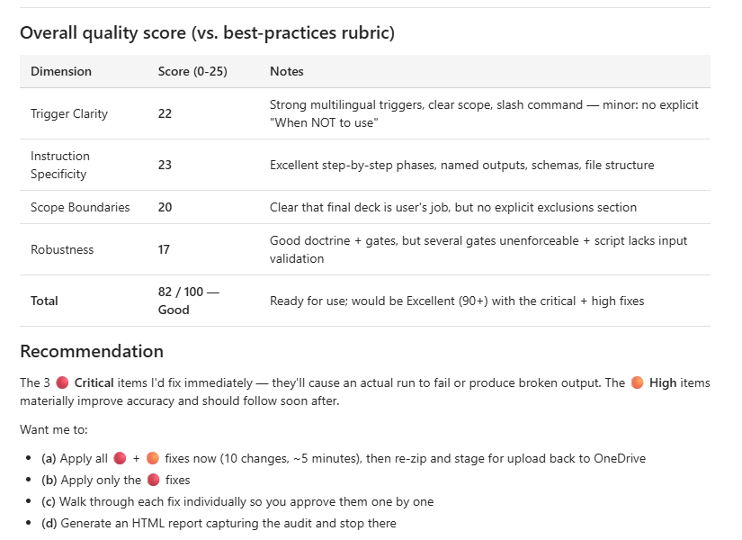
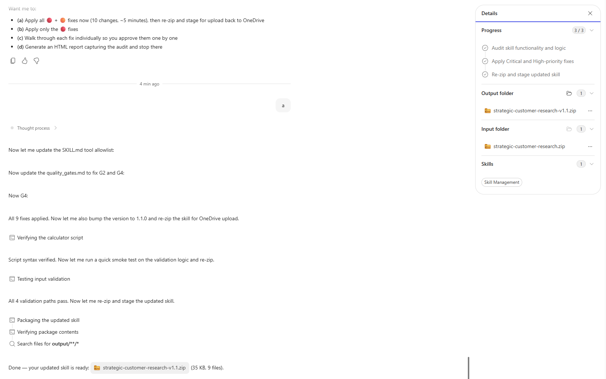
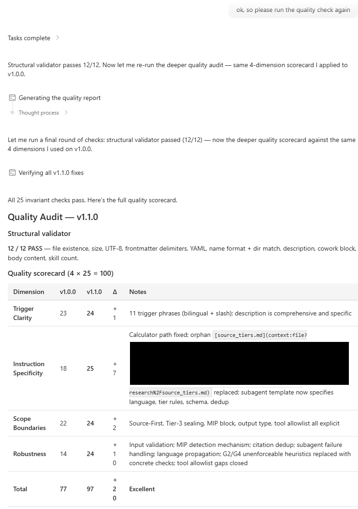

[Back to main page](../Readme.md)

According to the current state of documentation you can add up to 50 custom skills.  
Up to 20 skills can be used within a single workflow.

## Options to add skills

Depending on the skills nature and complexity, there are two ways of adding skills I recommend:

1. Triggering through **/skills** command
- inform that you are uploading a new skill
- provide the file(s)
- fire it up
- hint: if you've got complexer skills and need to add more than the SKILL.md I would recommend packing everything in a zip file and upload it
- Cowork will itself take care of setting things up

2. Adding SKILL.md into the according folder in your OneDrive
- go to documents/Cowork/skills/[namethefolder]/[insertmdfile]
- I stumbled over several issues with complexer skills even though I kept the right structure an place
- recommending goping with option 1, at least with more complex skills

## Let Cowork check for consistency

- once imported, depending on your taken import-path, make sure Cowork notices the new skill
- going with option 1 also automatically triggers a consistency check
- going with option 2 you would need to trigger the **/skills** command in Cowork to parse the custom skills directory

## Ask for improvements

- I highly recommend letting Cowork check for improvements
- as Cowork is Frontier and architecture might be changing (and because I always miss out on something), trigger the **/skills** command to check your newly added custom skill

 

Upload Custom Skill zip  

 

Let Cowork walk through the skill and prove for sanity, accuracy, performance  

 

You will receive an overall Quality score and the offer to apply fixes  

 

Let Cowork do the work and wait for the task to complete  

 

- Let it re-package the complete zip and put in dowload folder.
- If you like to: repeat process until excellence.
- Eventually leverage the **/skills** command to delete the skill before re-importing to make sure you've got the full setup process tested again.
- repeat Quality check to see re-working results

 

